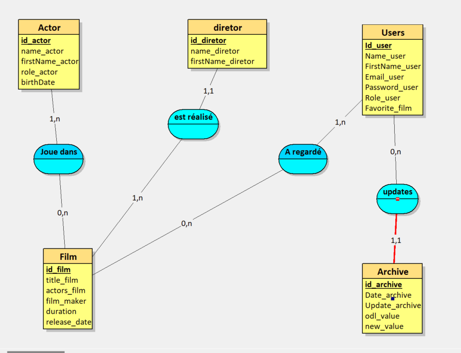
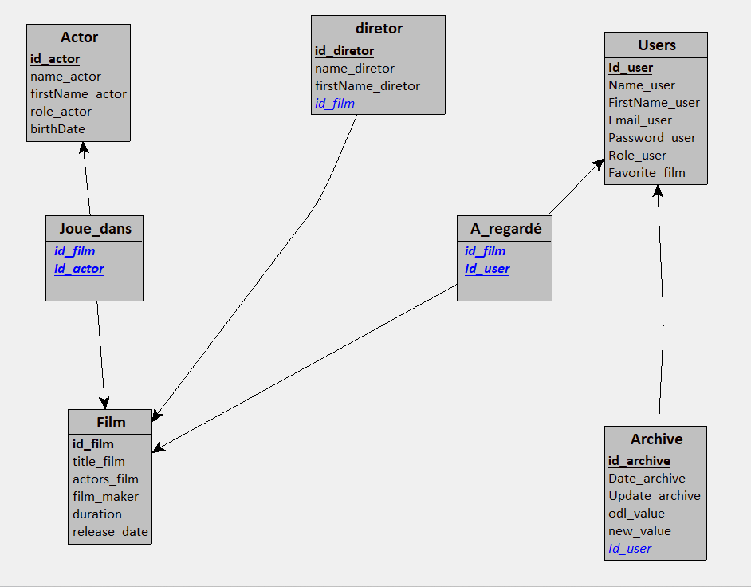
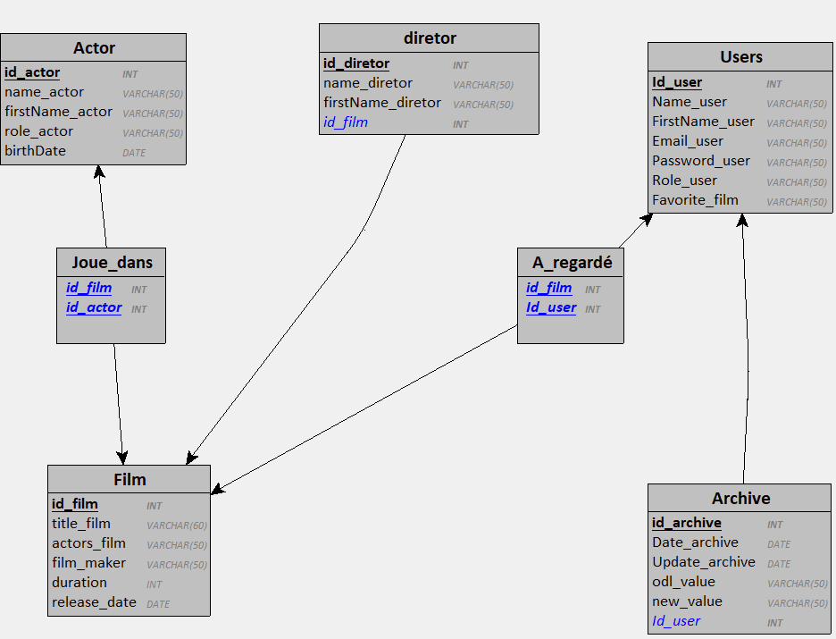

# streaming


*Design a database, Store data*

## Desciption

## Setup

> docker compose up

### Database structure

*Incredible MCD*



*Incredible MLD*



*Incredible MPD*


### Queries

*A minimal set of queries to test your database:*

✅Retrieve the titles and release dates of movies from the most recent to the oldest.

```sql
SELECT title_film, release_date FROM film ORDER BY release_Date DESC;
```

⬜Get the names, first names, and ages of actors/actresses over 30 years old in ⬜alphabetical order.
⬜Retrieve the list of lead actors/actresses for a given movie.
⬜Fetch the list of movies for a given actor/actress.
⬜Add a new movie.
⬜Add an actor/actress.
⬜Update a movie.
⬜Delete an actor/actress.
⬜Display the 3 most recently added actors/actresses

*advanced operations:*

⬜Use a stored procedure to list movies directed by a specified director as a parameter.
⬜Use a trigger to keep a record of all modifications made to the users' table. An ⬜archive table will store the update date, the user's identifier, the old value, and the new value.

### Deliverables

*A GitHub repository containing:*

✅ Docker environment  
✅ Data dictionary  
✅ Conceptual Data Model   
✅ Physical Data Model   
✅ Logical Data Model   
✅ A file for generating the database    
⬜ Query set in the README.md  

## Author

* Melanie Chauvin

## License
